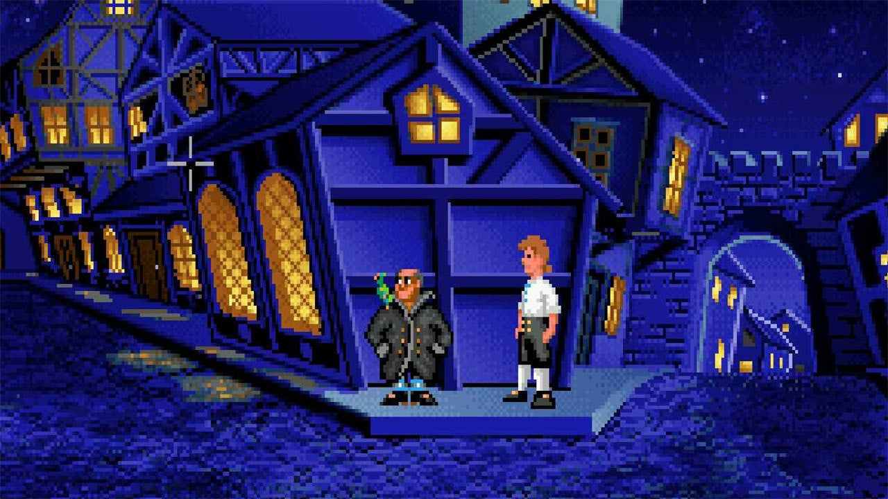
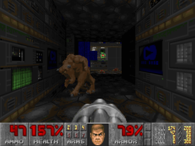
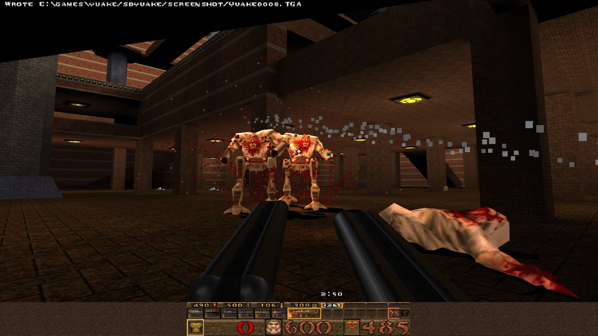

  People have been using computers to display pretty pictures for a very long time. Today I am going to give a brief
  overview of the history of consumer computer graphics. Many of the classes of hardware discussed below were actually
  in use at the same time. The cause being primarily market forces. A gamer does not care how well his/her
  game console can render large blocks of text, while a business user does not usually care if the computer
  can play games well. Therefore for a long period graphics hardware was often quite specialized and lacked
  core features that other systems relied on.
## Pixel Based (Little to no acceleration)
  For most of the history of consumer machines the resolution of displayed images was limited by how much memory the
  computer had. For example a 1080p image takes up 1 Megabyte of space. Up until 1985 it would be impossible to store
  that much data in an IBM PC's memory (Irvine,29). Consumer computers graphics system worked around memory limitations
  by limiting the resolution and number of colors. Limiting the colors is especially helpful because each additional color
  requires more space inorder to encode the data. One example system is VGA (Video Graphics Array). VGA is still present in
  the form of the connecture used for it, the VGA connector. VGA has a resolution of 320x200 Pixels with 256 possible colors (Ferraro, 257). This video mode is very limiting because the programmer has to manually place every pixel on the screen and this takes the computer quite a bit of time to go through and change each and every pixel. It could be much faster to
  have some hardware that could do some work for the central processing unit. An example of what pixel based graphics could achieve is shown below. The image depicts a screen shot from he Secret of Monkey Island by Lucasfilm Games released in     
  October 1990
  
  The screenshot has beautiful hand drawn textures, but this technology limits what can be done with a computer.
## Sprite acceleration
  In the 1980's and the early 90's many home computers were built to do work rather than play games, therefore many
  of the video systems were built inorder to accommodate business users rather than games. Many games systems however, such
  as the Super Nintendo Entertainment system were built from the ground up in order to play games. One of these features
  were sprites which were basically images that the programmer could move around.
 
  
 
  This approach made some games much faster. For example the texture of an enemy could be a sprite and multiple sprites
  could be moved on the screen without the programmer directly changing each pixel in the enemy. This makes the game much '
  faster as the computer does not have to tell the video chip what color every single pixel will have. This allowed
  fast paced games like Super Mario Brothers to be created on (even at the time) slow and cheap hardware.
  This technique can be used to create interesting effects, for example the Super Nintendo Entertainment System has a mode where sprites can be reshaped allowing for effects that simulate 3d graphics.
  (Retro Game Mechanics Explained).
## 3d Accelerators

  Programmers always wanted to make 3d games as it allows more gameplay options to be explored than with 2d games. 3D games
  however require a large amount of computational power. In the early history 3d games used very simple graphics with
  simple graphics consisting of lines or sometimes filled in polygons. These methods were very slow because programmer
  written code had to calculate where every single polygon fit on screen. One of the most advanced software renderd 3d games
  is shown below, Doom by ID Software
 
  
 
  in the mid 90's 3d accelerator cards started
  to appear onto the consumer market. One example is the 3dfx Voodoo card (Sanglard). These devices used specialized hardware inorder
  to draw 3d graphics. These systems were much faster than traditional techniques and allowed much more interesting games
  to appear. An example of an early 3d accelerated game (Quake by ID Software) is shown below.
 
  
## Programming Style
  Many lower performance systems in the past required the programmer to have a deep understanding of the hardware inorder to
  produce any usable results. Programmers have to manually keep track of the state of the hardware and these techniques are
  very time consuming and error prone. As computers got faster it became more common for graphics hardware to have simpler
  interfaces inorder to make the programmers job easier. This is a big shift because many of the details of the hardware
  become hidden from view and it makes it far easier to create complicated programs. This change has caused many other changes
  in the computer industry. One big example is portability of programs. In the past it was very hard to get a program
  to run on a different computer because the game relied on intricate details of the computer in question.
  With the advent of standard interfaces it is very easy to move to a completely new platform and it can be as easy as clicking
  on a couple of extra buttons.
## General Purpose Compute
Initially 3d accelerators could only draw 3d graphics. Slowly the abilities of these graphics systems grew and could do more advanced tasks. In 2004 a new version of OpenGL a industry standard, used by programmers to write shaders on graphics chips.
This version allowed the programmer to write programs that would run on the graphics chip. This made it easier to
leverage the graphics equipment for tasks that are not strictly related to puting pixels onto a screen. Graphical
processors can be much faster than traditional processors because they can do tasks in many small chunks at the same time
rather than doing and finishing one task and moving onto the next task. Graphics processors are used in many real world
calculations such as Bioinformatics and weather simulation (CUDA).
## The Future
  It is unclear what the future holds for real time computer graphics. Many high end systems are held back more by the
  time and money used to create the art that will be rendered rather than the horsepower of the computer. There are some
  potential places for advancement. One being lighting. NVIDIA, a maker of high performance graphics chips has recently
  released a new generation of processors that can do a technique called ray tracing in real time. This method can create
  much more realistic lighting but there is much debate in the gaming community of whether the advancement is worth the hit to
  performance
## Citations
“CUDA.” CUDA, NVIDIA, 18 Nov. 2019, https://developer.nvidia.com/cuda-zone.

"GEFORCE RTX 20 SERIES" Nvidia 20 Nov. 2019, https://www.nvidia.com/en-us/geforce/20-series/

Ferraro, Richard F. Programmers Guide to the EGA and VGA Cards. 2nd ed., Addison-Welsey, 1990.

Learn OpenGL. https://learnopengl.com/.

Nye, Adrian. Xlib Programming Manual. O'Reilly & Associates, 1990.

Ruetsch, Gregory, and Massimiliano Fatica. Cuda Fortran for Scientists Amd Engineers. MK, 2014.

 Sanglard, Fabien. “The Story of the 3dfx Voodoo1.” FABIEN SANGLARD'S WEBSITE, 4 Apr. 2019, http://fabiensanglard.net/3dfx_sst1/index.html.
 
“SNES Background Modes 0-6 - Super Nintendo Entertainment System Features Pt. 04.” Retro Game Mechanics Explained, 1 Oct. 2017.
 
Vulkan Tutorial . https://vulkan-tutorial.com/.

